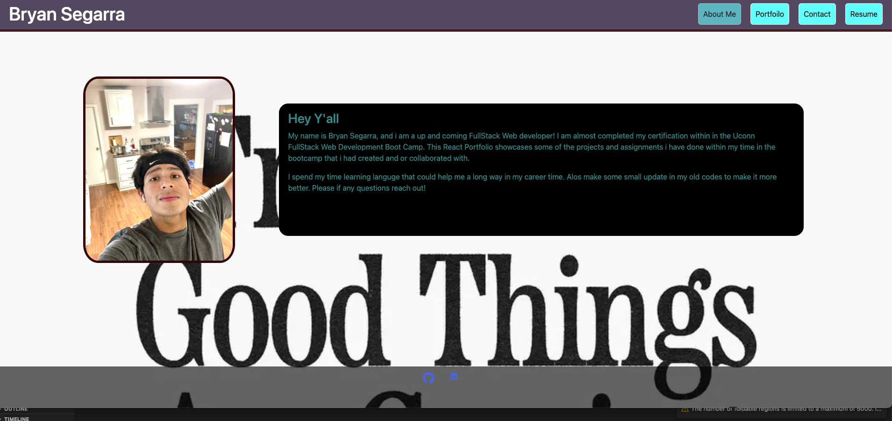

# React-
[]

  ## Table-of-Contents
  * [Description](#description)
  * [Installation](#installation)
  * [Usage](#usage)
  
    *[License](#license)
    
  * [Contributing](#contributing)
  * [Questions](#questions)
  
  ## Description
  This is a more of a upgrade of a portfoilo but with react and also with function this have my resume, and some of the project that i have done in my past and also a group project.
  here is the deployed site: https://bryguy20.github.io/React-Portfoilo/

  ## [Installation](#table-of-contents)
  just need to npm i and npm start .

  ## [Usage](#table-of-contents)
  here is a picture of the site:
   
  ## Contributing
   
      Thank you for your interest in helping out; however, I will not be accepting contributions from third parties.
      
  ## [Tests](#table-of-contents)
  none

  ##  [Questions](#table-of-contents)
  Please contact me using the following links:
  [GitHub](https://github.com/bryguy20)
  [Email: bryansegarra044@gmail.com](mailto:bryansegarra044@gmail.com)
